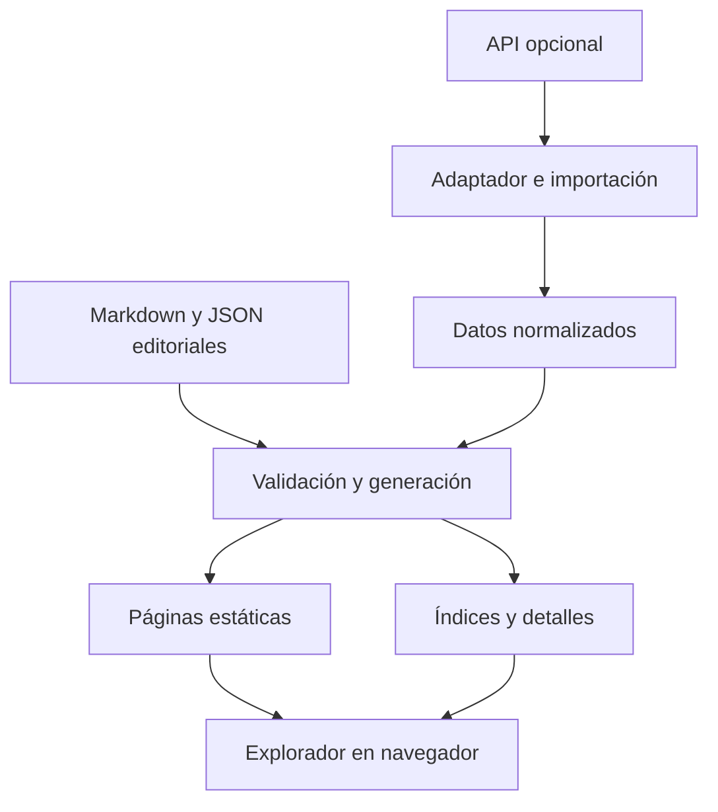

# Arquitectura y herramientas

> Base inicial y prototipo de cronología implementados. Este documento conserva la propuesta completa; las decisiones efectivas están en [08-base-inicial.md](08-base-inicial.md), [09-cronologia-inmersiva.md](09-cronologia-inmersiva.md) y README.

## Enfoque

Sitio estático generado con Astro y un explorador React. El navegador controla la interacción; la compilación prepara páginas e índices. Node.js puede utilizarse para desarrollo e importación sin requerir un servidor Node permanente en producción.

## Stack

| Herramienta | Responsabilidad | Momento |
| --- | --- | --- |
| TypeScript estricto | Contratos y lógica | Inicial |
| Astro | Rutas estáticas, contenido y compilación | Inicial |
| React | Controles, selección, paneles y explorador | Inicial |
| d3-scale / d3-zoom / d3-selection | Escalas y gestos; React dibuja | Prototipo de fase 2 implementado |
| SVG y HTML | Líneas, marcas y contenido accesible | Inicial |
| Markdown y JSON | Contenido editorial y estructura | JSON en la base; Markdown pendiente |
| Esquemas compatibles con Astro / Zod | Validación de datos locales y remotos | Inicial |
| MiniSearch | Búsqueda local | Cuando sea útil para el corpus |
| CSS con variables | Identidad visual y estados | Inicial |
| Git | Versionado de código y contenido | Inicial |
| Vitest / Playwright | Pruebas de dominio e interacción | Según fases y compatibilidad verificada |
| React Flow | Grafo independiente con nodos propios | Posterior y opcional |

No fijar números de versión en esta especificación. Verificar documentación y compatibilidad al instalar.

## Límites entre módulos

- Importación: peticiones, paginación, validación de respuestas y snapshots.
- Dominio: eventos, tiempo, referencias, filtros y autorización editorial por spoilers.
- Layout: posiciones, grupos, visibilidad espacial y curvas de conexiones.
- Interfaz: paneles, controles y presentación.
- Generación: páginas estáticas, índices de búsqueda y archivos de detalle.

El dominio no debe depender de React, D3 o la API elegida. React y D3 no deben competir por modificar los mismos elementos DOM: preferir D3 para cálculos/gestos y React para renderizar, con integración explícita mediante referencias donde sea necesaria.

## Estructura orientativa

| Ruta propuesta | Contenido |
| --- | --- |
| src/pages/ | Inicio, explorador y páginas estáticas de eventos |
| src/components/explorer/ | Cronología, filtros, buscador y panel |
| src/components/ui/ | Controles y elementos visuales reutilizables |
| src/domain/ | Tipos y reglas independientes de la interfaz |
| src/visualization/ | Escalas, agrupación, layout y viewport |
| src/lib/ | Utilidades de URL y búsqueda |
| src/content/ | Markdown editorial |
| src/data/editorial/ | Entidades, épocas, relaciones y configuración |
| src/data/generated/ | Salida normalizada y combinada; no editar a mano |
| scripts/import/ | Adaptadores e importación |
| tests/fixtures/ | Datos sintéticos y respuestas de API anonimizadas cuando corresponda |
| public/ | Recursos estáticos públicos |
| docs/ | Especificación y decisiones |

La ubicación exacta del contenido se ajustará a la API de colecciones de la versión de Astro elegida.

## Estado del navegador

- URL: evento seleccionado, filtros y vista que tenga sentido compartir.
- React: paneles, interacción transitoria y viewport en movimiento.
- localStorage opcional: preferencias y progreso.
- No introducir una biblioteca global de estado hasta que la complejidad lo justifique.
- No modificar el historial por cada píxel de arrastre; actualizarlo al terminar la interacción.
- El contenido bloqueado sigue bloqueado aunque una URL solicite abrirlo.

## Rendimiento

Generar un manifiesto ligero con metadatos mínimos. Separar descripciones extensas y diálogos del índice inicial. Filtrar por spoilers antes de mostrar resultados y antes de calcular grupos visibles, para evitar filtraciones por conteos o conexiones.

Agrupar, evitar solapamientos y limitar lo renderizado. Evaluar Canvas/WebGL solo si mediciones representativas justifican su complejidad y se conserva una alternativa accesible.

## Alternativas

- React + TypeScript + Vite: simplifica una aplicación de una sola pantalla, pero exige resolver por separado las páginas estáticas si se quieren.
- Astro + Vue + TypeScript + D3: alternativa válida si el desarrollador prefiere Vue.
- No mezclar React y Vue dentro del explorador sin una necesidad concreta.

## Publicación

Salida estática alojable en un servicio compatible. Proveedor y dominio pendientes. Generar una versión candidata, validarla y publicar de forma que el fallo de una compilación no sustituya la versión válida. Despliegue requiere una solicitud explícita; este documento no lo ejecuta.
