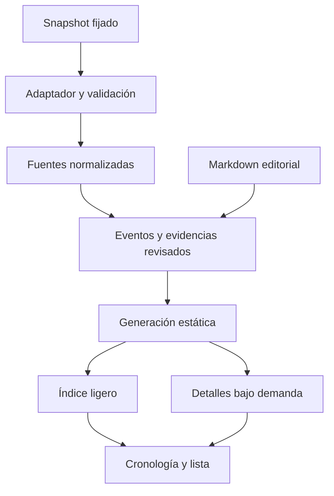

> **Actualización 28/09/2026 — borrador del dossier:** por instrucción explícita del usuario, la página sustituye la vista previa de fuentes por la historia de los documentos 00–03. Son 29 acontecimientos, siete capítulos, 35 conexiones y fichas de personajes/lugares, visibles como `provisional`. No se contrastan fuentes ni se asignan spoilers todavía. Esta entrega no equivale a completar P3–P7 ni a aprobar editorialmente el lore. Véase [implementación y validación](validation/dossier-historia-antigua.md). La referencia a la vista previa temporal que sigue es histórica; su interruptor ya no controla el sitio.

> **Actualización 05/10/2026 — primera versión:** el alcance de la v1 (29 acontecimientos como techo) está fijado en [docs/11](11-alcance-primera-version.md). Se implementaron el índice ligero, la política de spoilers, la búsqueda y los filtros, el registro de evidencias y las pruebas de navegador; la revisión editorial sigue pendiente de aprobación y las sesiones con participantes, el lector de pantalla, el teléfono real y otros navegadores siguen sin ejecutarse. Véanse el [procedimiento](12-procedimiento-revision-editorial.md) y los informes de [lectura](validation/revision-lectura-2026-10-05.md), [accesibilidad](validation/accesibilidad-compatibilidad.md) y [rendimiento](validation/rendimiento-2026-10-05.md). Las fases P3–P7 de este plan no se declaran completas.

# Plan de integración de lore y validación — Irminsul Atlas

> **Seguimiento del cierre técnico, 05/10/2026:** la [matriz vigente del plan general](06-plan-de-trabajo.md) y el [informe del cierre](validation/cierre-tecnico-v1.md) prevalecen sobre los estados históricos siguientes. P3 dispone de registro de evidencias y revisión individual de eventos/relaciones, pero ninguna afirmación real está aprobada. P4 tiene búsqueda, filtros, progreso y detalles diferidos; faltan revisión de revelación y filtros por facción/categoría. P5 conserva pendientes de agrupación y navegación entre hilos. P6 tiene mediciones y pruebas automatizadas, no sesiones humanas. P7 no cierra aún impacto de cambios ni recuperación editorial. La meta posterior incluye el viaje del Viajero y cobertura hasta una versión pública comprobada.

Fecha: 25 de septiembre de 2026, Costa Rica.
Archivo: `docs/10-plan-integracion-lore-y-pruebas.md`.
Estado al 27/09/2026: P0 auditada; Git/GitHub verificados. P1 aprobada por el usuario con los límites de cobertura documentados. P2 implementa adquisición, normalización, validación, comparación y promoción local; evidencia en [importador P2](validation/importador-p2.md). P3–P7 pendientes. Antecedentes: [estado actual P0](validation/estado-actual.md), [cobertura P1](validation/cobertura-fuentes.md) y [aprobación humana](validation/p1/revision-humana.md).

Vista previa temporal del 27/09/2026: a petición del usuario, se muestran las fuentes P2 en el lienzo mediante `src/content/preview.ts`. Posiciones y conexiones son ilustrativas; no constituyen eventos editoriales aprobados ni completan P3. La proyección puede desactivarse con `lorePreviewEnabled = false`.

## 1. Alcance y evidencia disponible

Objetivo: incorporar material narrativo de Genshin a la cronología mediante importaciones reproducibles, conservar evidencia de cada afirmación y comprobar que el contenido se puede explorar sin errores ni spoilers accidentales.

En la elaboración original de este plan se revisaron los nueve Markdown de `genshin-lore-documentacion.zip` y la versión disponible de `styles.md`. El README de aquel paquete lo describía como documentación; su `06-plan-de-trabajo.md` mantenía todas las fases pendientes. Aquel espacio consultado no contenía el repositorio de VS Code, `package.json`, código fuente ni resultados de pruebas de esa instalación.

Por tanto, el diagnóstico original de esta sección comprobaba el estado DOCUMENTADO. También existía una referencia a un prototipo anterior de Irminsul Atlas; no se utilizó para certificar funcionalidades actuales.

P0 se realizó después dentro del repositorio real. Los informes enlazados al inicio acreditan la implementación y los resultados comprobados; los contratos y fases siguientes de este plan siguen siendo requisitos, no funcionalidades implementadas. No volver a crear módulos que la auditoría encuentre ya implementados y correctos.

### Diagnóstico de la base documentada

| Área             | Evidencia disponible                                                       | Ajuste necesario                                                                      |
| ---------------- | -------------------------------------------------------------------------- | ------------------------------------------------------------------------------------- |
| Stack            | Astro + React + TypeScript estricto propuestos en README y arquitectura    | Confirmar dependencias y versiones efectivas en el repositorio                        |
| Dominio          | Eventos, entidades, fuentes, evidencias, misiones y spoilers especificados | Ampliar la entrada a libros, cartas, objetos y conversaciones ambientales             |
| Importación      | Flujo genérico de API, snapshots y diferencias                             | Concretarlo para archivos de un repositorio fijado a un commit; no inventar endpoints |
| Cronología       | Orden narrativo por épocas, tres niveles y agrupación                      | Verificar implementación; conservar fecha desconocida e incertidumbre                 |
| Identidad visual | `styles.md` ya define crema/carbón, tokens y comportamiento                | Actualizar menciones antiguas de «estilo pendiente» al integrar esta guía             |
| Spoilers         | Reglas documentadas para eventos, relaciones, conteos y metadatos          | Aplicar también a fragmentos de fuentes, entidades y carga inicial de HTML            |
| Pruebas          | Casos prioritarios descritos                                               | Convertirlos en pruebas repetibles y sesiones manuales con resultados guardados       |
| Contenido real   | No hay corpus revisado en los archivos consultados                         | Crear muestra verificable antes de ampliar a 30–50 eventos                            |

## 2. Decisión de integración

Fuente primaria propuesta: `DimbreathBot/AnimeGameData`, consumida fuera del navegador. Utilizar una copia identificada por commit completo y un adaptador propio. No descargar la rama cambiante automáticamente en cada compilación.

El análisis previo de documentación, código y muestras encontró:

- AnimeGameData contiene `TextMapES.json`, `TextMap_MediumES.json`, `Readable/ES` y estructuras de misiones/conversaciones.
- JettyCoffee organiza en JSON misiones, personajes, libros y objetos. Su lector revisado carga solamente el TextMap principal; sus mapeos de campos difieren de muestras actuales. Es una referencia de diseño, no una dependencia validada.
- Hoyo-story-extractor combina TextMap principal y Medium y aborda `CodexQuest` y `Talk`. Su conversión revisada está adaptada a 6.6; no se certificó compatibilidad con los datos actuales. Su sustitución genérica de enteros por textos exige cuidado con la trazabilidad.
- Genshin-db puede enriquecer metadatos, pero no sustituye el corpus narrativo. Genshin-manager no se requiere para esta integración.

Estas observaciones no equivalen a una extracción completa ni a un porcentaje de cobertura. Un repositorio reciente tampoco demuestra que conserve todos los eventos antiguos.

Preferencia inicial: importador pequeño en TypeScript, para mantener un solo entorno si el proyecto aún no usa Python. Adoptar Python solo si una prueba de extracción demuestra una ventaja concreta; su salida debe respetar el mismo contrato JSON y el frontend no debe depender de él. Evaluar las condiciones del código antes de reutilizarlo; no equiparar la licencia de un extractor con la del contenido del juego.

### Flujo objetivo



El sitio publicado sigue siendo estático. No se añade base de datos, autenticación, panel editorial, grafo libre ni descarga masiva de diálogos en el cliente.

## 3. Contratos y límites que deben quedar definidos

Reutilizar los esquemas existentes cuando P0 los encuentre. La tabla siguiente conserva las responsabilidades propuestas. P2 concreta los contratos de manifiesto, fuentes/segmentos, selección, candidato, informe, comparación y versión aceptada en `src/domain/schema.ts`; la integración con evidencias/eventos y su aprobación editorial sigue pendiente de P3. Véase el informe P2 para los nombres y archivos efectivos.

| Concepto         | Información mínima                                                                                                                    |
| ---------------- | ------------------------------------------------------------------------------------------------------------------------------------- |
| SnapshotManifest | Proveedor, commit completo, fecha de adquisición, versión declarada si existe, idiomas, versión del adaptador, inventario y checksums |
| SourceRecord     | ID interno estable, tipo de fuente, ID externo cuando exista, idioma, título, versión de fuente y localizador original                |
| SourceSegment    | ID/localizador verificable, contenido, hablante si está disponible, orden y ramas cuando existan, hash del texto original             |
| Evidence         | Fuente y segmento, afirmación respaldada, localizador, revisión y observaciones                                                       |
| LoreEvent        | Modelo editorial ya previsto: tiempo, época, importancia, resumen, participantes, evidencias y spoilers                               |
| ImportReport     | Conteos por categoría, registros procesados/omitidos, textos sin resolver, errores, cambios y versión candidata                       |

Tipos de fuente iniciales: misión, conversación ambiental, libro/documento, historia de personaje, historia de arma, historia de artefacto y descripción de objeto. Añadir otros tipos cuando un caso real lo requiera. Manga o vídeos oficiales se incorporan como referencias editoriales externas; no asumir que están contenidos en el dump.

Reglas obligatorias:

1. Una misión no se convierte automáticamente en un evento. Relación muchos-a-muchos mediante evidencias.
2. No usar títulos traducidos ni posición dentro de un array como identidad única. Diferenciar tipos/proveedor para evitar colisiones. Idioma identifica la variante; snapshot identifica la versión, no cambia por sí solo el ID editorial.
3. Cuando no exista un ID externo fiable, registrar un localizador determinista y tratar cambios de localizador como posibles remapeos pendientes de revisión.
4. Conservar texto original, referencia y versión; generar texto de presentación por separado. No resolver enteros indiscriminadamente sin conocer qué campo representa un texto.
5. Combinar los TextMap necesarios y detectar colisiones con contenido diferente. No permitir que el orden de lectura oculte un conflicto.
6. Una traducción ausente se informa. No sustituir silenciosamente español por inglés ni presentar el ID como texto.
7. Mantener elecciones y ramas de conversación; no concatenar alternativas como si todas hubieran ocurrido.
8. Registrar textos eliminados, modificados o inaccesibles sin borrar eventos editoriales automáticamente.
9. Tratar texto/Markdown importado como entrada no confiable. Sin ejecución de MDX remoto, HTML arbitrario o URLs peligrosas.
10. Toda afirmación causal o temporal debe tener evidencia o quedar identificada como interpretación. Fecha de parche, orden de desbloqueo y fecha histórica son dimensiones distintas.

### Ubicaciones propuestas, sujetas a P0

| Ruta                                   | Responsabilidad                                                  |
| -------------------------------------- | ---------------------------------------------------------------- |
| `scripts/import/`                      | Adquisición manual, adaptador, normalización e informes          |
| `src/domain/`                          | Tipos y reglas reutilizables; sin dependencias de UI o proveedor |
| `src/data/editorial/` y `src/content/` | Eventos, relaciones y explicaciones humanas                      |
| `src/data/generated/`                  | Datos generados validados; nunca corregirlos a mano              |
| `tests/fixtures/import/`               | Casos mínimos versionados y casos de error                       |
| `tests/e2e/`                           | Flujos de navegador sobre la salida compilada                    |
| `docs/validation/`                     | Auditoría, cobertura, resultados manuales y decisiones           |
| Caché fuera de `public/`               | Datos brutos y candidatos; ignorados por Git según tamaño        |

No añadir capas vacías ni duplicar un modelo que ya sea válido. Los artefactos públicos se generan a partir de una lista explícita de archivos, nunca copiando la caché completa.

## 4. Plan por fases y condiciones para avanzar

### P0 — Auditar el repositorio real

Trabajo:

- Leer instrucciones, documentación, `package.json`, lockfile y configuración real; revisar cambios sin confirmar.
- Inventariar rutas, componentes, dominio, carga de datos y pruebas existentes.
- Ejecutar los comandos que ya existan para tipos, pruebas y build. Registrar fallos previos por separado.
- Mapear RF-01 a RF-12 como implementado comprobado, parcial, ausente o no verificable. Anotar evidencia por archivo/comportamiento.
- Comprobar si `styles.md` se aplica, si hay datos demo mezclados con reales y si ya existe un proveedor.
- Registrar un punto recuperable con Git sin incluir ni descartar cambios ajenos a la tarea.

Entrega: `docs/validation/estado-actual.md`, tabla de brechas y mapa de archivos reales a modificar.

Puerta: stack y recorrido actual de datos identificados; cada supuesto relevante señalado. Si solo hay documentación, completar primero la base ejecutable del plan original con fixtures sintéticos; verificarla antes de conectar fuentes.

### P1 — Probar la cobertura de la fuente

Trabajo:

- Seleccionar un commit concreto del proveedor y registrar el hash completo; adquirir solo los archivos necesarios.
- Establecer una muestra manual con IDs y localizadores reales, sin inventarlos.
- Inspeccionar TextMap, Medium, documentos y conversaciones. Determinar qué campos están ofuscados y qué rutas corresponden al snapshot.
- Comparar los extractores como referencia; no instalar ambos en producción por defecto.
- Crear una tabla por categoría: disponible, parcial, ausente o desconocida; incluir versión, idioma y causa.

Muestra de aceptación: una misión de Arconte, una del mundo, una legendaria, un encuentro ramificado, un evento temporal antiguo, uno reciente, un diálogo ambiental, un libro de varios volúmenes, una carta, una historia de personaje, una de arma y las piezas de un conjunto de artefactos. Un caso puede respaldar varios eventos editoriales.

Para cada caso, una persona verifica hablantes, comienzo/final, ramificaciones relevantes, textos y localizadores frente a la fuente identificada. Un elemento fuera de la cobertura se registra como tal, no como extracción exitosa.

Entrega: `docs/validation/cobertura-fuentes.md`, manifiesto del snapshot y decisión TypeScript/Python.

Puerta: muestra mínima suficiente para una primera integración, con todos los segmentos seleccionados para publicación verificables. Si una categoría falla, se corrige o se excluye explícitamente del primer incremento y se define una fuente alternativa. No afirmar cobertura total.

### P2 — Construir el importador reproducible

Trabajo:

- Separar adquisición de transformación: poder normalizar una copia local sin red.
- Resolver campos por versión, traducciones y documentos; preservar IDs y ramas.
- Validar esquema, referencias y completitud de los archivos esperados. No saltar JSON corruptos silenciosamente.
- Generar en un directorio candidato; emitir errores con categoría, archivo, campo e ID.
- Comparar con la última importación aceptada y promover únicamente tras validación.
- Ordenar la salida de forma estable. Mantener fechas de ejecución fuera del contenido utilizado para comprobar determinismo.

Entrega: primer adaptador, fixtures y reporte legible de importación.

Puerta: dos ejecuciones con el mismo snapshot/configuración producen contenido equivalente; pruebas de error conservan intacta la última salida válida. Ningún texto sin resolver alcanza las fuentes aprobadas.

### P3 — Integrar una muestra editorial de 8–12 eventos

Trabajo:

- Elegir un conjunto coherente de hechos verificados, con al menos dos épocas y diferentes tipos de fuente.
- Vincular fuentes y segmentos a eventos usando el modelo existente.
- Cubrir fecha desconocida, intervalo aproximado, varios eventos respaldados por una fuente y un evento respaldado por varias fuentes.
- Incluir una relación lejana y un evento con bloqueo de spoilers. No inventar una contradicción histórica para probarla: usar fixtures sintéticos separados si no hay un caso real seleccionado.
- Marcar borradores/revisados/demo y hacer que la compilación normal publique solo contenido aprobado. La vista demo, si existe, debe ser explícita.

Entrega: primera colección editorial real, con todas las evidencias revisadas.

Puerta: el 100% de los eventos y relaciones publicados tiene referencias resolubles y revisión. La IA puede proponer borradores, nunca aprobarlos automáticamente.

### P4 — Conectar lectura, búsqueda y spoilers

Trabajo:

- Conectar las consultas del dominio a las páginas/componentes existentes. Si no hay explorador todavía, empezar por lista y ficha mínimas.
- Generar índice ligero y cargar detalles por evento. Mantener diálogos extensos fuera del paquete inicial.
- Aplicar una sola política de visibilidad a eventos, relaciones, fuentes, fragmentos, entidades y resultados.
- Probar URL directa, recarga, atrás/adelante, almacenamiento deshabilitado, filtros vacíos y error al cargar detalle.
- Definir el HTML inicial y los metadatos neutros de páginas sensibles: la hidratación no debe ocultar tarde un spoiler ya mostrado.

Entrega: recorrido «buscar → abrir evento → leer evidencia → volver» funcionando sobre contenido real.

Puerta: la página compilada funciona con el proveedor externo inaccesible. Los detalles locales siguen cargando. Esto no exige funcionamiento sin Internet del sitio entero ni una PWA.

### P5 — Integrar y comprobar la cronología

Trabajo:

- Alimentar el layout desde el modelo propio, nunca desde objetos del proveedor.
- Completar únicamente las funciones faltantes: épocas, niveles de detalle, agrupación, zoom, selección y relaciones.
- Mantener ancla y selección al abrir ficha, cambiar tamaño y atravesar un umbral de zoom.
- Aplicar `styles.md`: etiquetas legibles, superficies correctas, área táctil de 44 × 44 px, lectura a 320 px y leyenda de orden narrativo.
- Mantener equivalencia con la lista: mismo conjunto autorizado, filtros y acceso al detalle.

Entrega: navegación temporal con los 8–12 eventos reales y fixtures densos separados.

Puerta: flujos esenciales utilizables con ratón, teclado y táctil; sin solapamientos que impidan seleccionar o leer. Superar zoom repetido, relación fuera de vista y regreso al contexto anterior.

### P6 — Ampliar, medir y probar con personas

Trabajo:

- Ampliar gradualmente a los 30–50 eventos revisados definidos por el MVP original.
- Ejecutar pruebas automáticas y el protocolo manual de las secciones siguientes.
- Medir con contenido real y con una colección sintética densa de 500 eventos para localizar límites; no publicar esta última como lore.
- Corregir problemas bloqueantes y repetir únicamente los escenarios afectados y la regresión necesaria.

Entrega: informe de pruebas, resultados de usabilidad y límites conocidos.

Puerta: RF-01 a RF-12 comprobados para el alcance acordado, sin incidencias críticas pendientes y con objetivos de rendimiento satisfechos o excepciones justificadas y aceptadas. Cinco participantes no certifican accesibilidad ni representan a todos los usuarios.

### P7 — Actualización y recuperación

Trabajo:

- Simular un segundo snapshot con altas, cambios y ausencias; identificar los eventos afectados mediante sus evidencias.
- Marcar revisión pendiente sin reescribir interpretaciones ni borrar contenido editorial.
- Distinguir fuente cambiada de importación incompleta. Preservar versión anterior y su procedencia.
- Comprobar compilación desde una instalación limpia con dependencias fijadas y snapshot identificado/disponible.
- Documentar cómo seleccionar/restaurar la versión válida anterior de datos y regenerar el sitio.

Entrega: guía operativa y ensayo de recuperación.

Puerta: fallo de descarga, esquema incompatible o traducción ausente no reemplaza datos aceptados. Publicar requiere una solicitud explícita posterior y debe conservar la visibilidad que ya tenga el sitio.

## 5. Matriz de pruebas automatizadas

Usar el ejecutor de pruebas existente. Si falta, Vitest para TypeScript y Playwright para flujos de navegador son opciones coherentes; si se adopta Python, probar el extractor en su propio entorno y validar también el contrato JSON en TypeScript. Verificar versiones compatibles al instalar. No imponer un porcentaje de cobertura de líneas como sustituto de estos casos.

| ID     | Caso y estímulo                                                 | Resultado esperado                                                           | Nivel           |
| ------ | --------------------------------------------------------------- | ---------------------------------------------------------------------------- | --------------- |
| IMP-01 | Texto presente solo en Medium                                   | Se resuelve y conserva su referencia                                         | Adaptador       |
| IMP-02 | Mismo hash con traducciones incompatibles                       | Conflicto explícito; no sobrescritura silenciosa                             | Adaptador       |
| IMP-03 | Campo ofuscado desconocido en fixture                           | Error explicable o cuarentena; nunca éxito vacío                             | Adaptador       |
| IMP-04 | JSON truncado, archivo ausente o descarga interrumpida          | Candidato rechazado; snapshot válido intacto                                 | Integración     |
| IMP-05 | Falta español de un segmento requerido                          | Informe con ID; no fallback silencioso                                       | Adaptador       |
| IMP-06 | Diálogo con opciones y narrador desconocido                     | Ramas preservadas; hablante desconocido explícito                            | Adaptador       |
| IMP-07 | Dos importaciones idénticas                                     | Salida normalizada equivalente y sin duplicados                              | Integración     |
| IMP-08 | Fuente cambia o desaparece                                      | Eventos vinculados marcados para revisión; no borrados                       | Integración     |
| DOM-01 | ID duplicado o referencia rota                                  | Validación falla con localizador                                             | Dominio         |
| DOM-02 | Fecha desconocida, rango inválido y orden relativo              | Incertidumbre preservada; rango inválido rechazado                           | Dominio         |
| DOM-03 | Ciclo causal/asociativo frente a ciclo de anterioridad estricta | No prohibir asociaciones cíclicas; detectar restricción temporal imposible   | Dominio         |
| DOM-04 | Misión y eventos en relación muchos-a-muchos                    | Evidencias independientes y consultables                                     | Dominio         |
| SEC-01 | Texto importado contiene script, HTML o URL peligrosa           | Se muestra como texto seguro o se rechaza; nunca se ejecuta                  | Integración/UI  |
| SPO-01 | Evento no autorizado                                            | Ausente de UI, resultados, sugerencias, conteos y grupos                     | Dominio/E2E     |
| SPO-02 | Extremos visibles, relación con spoiler propio                  | Relación y explicación ocultas                                               | Dominio/E2E     |
| SPO-03 | Fuente compartida contiene un fragmento posterior               | Solo evidencia autorizada; no abrir texto completo por defecto               | Integración/E2E |
| SPO-04 | URL de evento bloqueado en sesión nueva                         | HTML inicial, título y metadatos neutros; sin destello de spoiler            | E2E/build       |
| SPO-05 | Reducir progreso con una ficha abierta                          | Desaparecen selección, detalle, relaciones y resultados no permitidos        | E2E             |
| SPO-06 | URL solicita ampliar progreso                                   | No modifica permisos personales automáticamente                              | E2E             |
| UI-01  | Buscar por alias y seleccionar                                  | Ficha y evento correctos; contexto temporal visible                          | E2E             |
| UI-02  | Zoom cerca del umbral, abrir/cerrar panel                       | Sin parpadeos repetidos ni reinicio del contexto                             | E2E/manual      |
| UI-03  | Seguir relación lejana y regresar                               | Vuelve a selección/filtros/contexto acordado                                 | E2E             |
| UI-04  | Aplicar filtros, lista y cronología                             | Mismo conjunto de eventos autorizados; sin confundir agrupación con ausencia | E2E             |
| UI-05  | Filtro vacío, ID inválido y detalle 404                         | Mensaje útil, limpiar/reintentar/volver; sin pantalla rota                   | E2E             |
| UI-06  | Atrás/adelante, recargar y storage bloqueado                    | Estado documentado; funcionamiento esencial conservado                       | E2E             |
| UI-07  | Teclado, Escape y cierre de ficha                               | Sin trampa de foco y retorno al control válido                               | E2E/manual      |
| OPS-01 | Bloquear dominios del proveedor al navegar                      | Sitio y detalles publicados siguen funcionando                               | E2E             |
| OPS-02 | Fallar promoción y restaurar salida anterior                    | Datos editoriales intactos; reconstrucción válida                            | Integración     |

Las pruebas corrientes usan fixtures fijados y no dependen de la red. La actualización de proveedor tiene una comprobación separada sobre un snapshot candidato. No actualizar resultados esperados automáticamente para hacer pasar una regresión.

## 6. Protocolo de usabilidad

### Entorno

- Escritorio: navegador habitual del usuario y una segunda familia de navegador para flujos críticos.
- Automatización: Chromium primero; comprobar los flujos críticos también en Firefox y WebKit cuando estén disponibles.
- Móvil: emulación a 390 px y comprobación real en al menos un teléfono; la emulación no certifica gestos ni rendimiento del dispositivo.
- Lectura estrecha: 320 px. Escritorio de referencia: 1366 × 768.
- Teclado sin ratón, zoom del navegador al 200%, movimiento reducido y revisión con lector de pantalla, por ejemplo NVDA en Windows si está disponible.

Registrar equipo, navegador, versión, dataset, commit y condiciones. Una prueba no ejecutada figura como pendiente, nunca como aprobada.

### Sesión exploratoria con cinco participantes

Propuesta: combinar personas familiarizadas con Genshin y personas poco familiarizadas con la cronología. Ajustar contenido al progreso de cada participante para no exponer spoilers. Las invitaciones o contactos los organiza el usuario; este plan no envía mensajes.

No explicar qué botón pulsar. Pedir tareas y observar el recorrido. Limitar cada sesión a unos 20–30 minutos.

| Tarea                                              | Qué observar                                        | Criterio propuesto                                   |
| -------------------------------------------------- | --------------------------------------------------- | ---------------------------------------------------- |
| Encontrar un evento por tema o personaje           | Comprende búsqueda y filtros                        | 4 de 5 completan sin ayuda en menos de 90 s          |
| Abrir una fuente que respalde una afirmación       | Distingue resumen de evidencia y localiza fragmento | 4 de 5 en menos de 60 s                              |
| Acercarse a una época y volver a la vista general  | Descubre zoom y restablecer                         | 4 de 5 sin perderse ni necesitar instrucciones       |
| Seguir una relación lejana y regresar              | Mantiene orientación y selección                    | 4 de 5 completan sin reiniciar su exploración        |
| Ajustar progreso y abrir enlace bloqueado          | Entiende el aviso y conserva control                | Cero revelaciones accidentales en los casos probados |
| Explicar fecha incierta y separación entre eventos | No interpreta distancia como duración real          | 4 de 5 explican correctamente ambas ideas            |
| Repetir búsqueda y lectura en móvil/lista          | Puede usar la alternativa sin gestos precisos       | Flujo completo sin bloqueo de controles o texto      |

Son umbrales iniciales del proyecto, no resultados ni normas universales. Con muestra tan pequeña, guardar también número de éxitos, errores y observaciones; no presentar porcentajes como evidencia estadística fuerte.

Después de cada tarea preguntar «¿Qué tan fácil fue, del 1 al 7?» y «¿Qué esperabas que ocurriera?». Objetivo orientativo: mediana de facilidad al menos 5/7, sin bloquear una incidencia grave por obtener buena media.

Formato de registro: participante anónimo, tarea, éxito sin ayuda/con ayuda/fallo, tiempo, errores, facilidad, observación y severidad. No incorporar analítica externa al sitio para esta prueba.

### Severidad y repetición

- Crítica: spoiler accidental, evidencia atribuida al evento equivocado, pérdida de contenido o ejecución de texto importado. Bloquea la entrega.
- Alta: impide completar una tarea con móvil/teclado, navegación rota o selección inaccesible. Corregir antes de ampliar contenido.
- Media: provoca confusión recuperable, etiquetas ambiguas o vuelta al contexto poco clara. Priorizar según frecuencia.
- Baja: detalle cosmético sin impacto sobre lectura o interacción.

Repetir los casos fallidos después de corregirlos. Las pruebas automáticas no sustituyen la comprensión de la cronología por una persona.

## 7. Rendimiento y revisión visual

Medir sobre la compilación de producción local, no solo el servidor de desarrollo. Antes de fijar presupuestos definitivos, P0/P4 deben recoger una línea base del equipo y las condiciones de red/CPU utilizadas.

Objetivos iniciales propuestos:

| Medida                  | Objetivo y método                                                                                             |
| ----------------------- | ------------------------------------------------------------------------------------------------------------- |
| Índice de 30–50 eventos | Hasta 250 KB comprimidos, excluyendo textos extensos e imágenes; registrar tamaño real                        |
| Búsqueda/filtros        | p95 ≤ 200 ms desde la acción hasta resultados visibles, con detalles ya disponibles; mínimo 30 acciones       |
| Abrir ficha ya cargada  | p95 ≤ 200 ms con el mismo protocolo                                                                           |
| Zoom/arrastre           | Respuesta continua; investigar tareas del hilo principal > 50 ms vinculadas al gesto en trazas                |
| Página inicial          | Objetivo de laboratorio LCP ≤ 2,5 s y CLS ≤ 0,1 bajo condiciones fijadas; guardar mediana de tres ejecuciones |
| Escalado de datos       | Comparar 50 eventos reales y 500 sintéticos densos; renderizado limitado al viewport y agrupaciones           |

Si no se alcanza un objetivo, identificar primero el cuello de botella: índice demasiado grande, renderizado excesivo, texto en el bundle o recomputaciones. No migrar a Canvas/WebGL sin medir el beneficio y mantener lista accesible.

Revisión visual según `styles.md`: contraste en superficies claras/oscuras, texto seleccionable, foco visible, controles táctiles, etiquetas que no escalen hasta volverse ilegibles, panel móvil sin ocultar cierre y conexiones que no crucen títulos de manera obstructiva. El zoom del navegador debe seguir funcionando.

Las cifras anteriores son presupuestos propuestos, no mediciones del sistema ni certificaciones de métricas de campo.

## 8. Comandos y entrega por incremento

P0 debe reutilizar los comandos existentes y documentar su equivalencia. Si faltan, proponer scripts para estas responsabilidades:

| Comando propuesto          | Responsabilidad                                                  |
| -------------------------- | ---------------------------------------------------------------- |
| `npm run check`            | Comprobación de tipos y validaciones del framework               |
| `npm run test`             | Pruebas de dominio/adaptador sin red                             |
| `npm run content:import`   | Importación explícita de snapshot identificado a candidato       |
| `npm run content:validate` | Esquemas, referencias, evidencia y estados editoriales           |
| `npm run content:diff`     | Diferencias con importación aceptada anterior                    |
| `npm run build`            | Generación estática desde datos aceptados; no descarga implícita |
| `npm run test:e2e`         | Pruebas sobre salida compilada servida localmente                |

Los comandos actuales están en README y `package.json`. Existen `content:acquire`, `content:import`, `content:validate`, `content:diff`, `content:promote`, `content:evidence [ID]` y `test:e2e`. `content:evidence -- ID` permite comprobar fragmentos contra un candidato sin promoverlo; `validate` incluye la verificación contra el aceptado y exige prepararlo localmente. `validate:code` comprueba la base sin exigir datos importados. La aceptación de fuentes y la comprobación de hashes no aprueban contenido editorial. El ensayo completo de impacto y recuperación sigue pendiente de P7.

Cada incremento entrega: resumen de cambios, archivos afectados, snapshot/configuración utilizados, comandos ejecutados y resultado, fallos previos, nuevas limitaciones, evidencia manual cuando aplique y siguiente fase habilitada. No basta «todo funciona».

## 9. Prompts para trabajar con Codex en VS Code

Enviar uno por fase. El primer prompt es una auditoría; los siguientes autorizan la implementación de su fase una vez cumplidas sus precondiciones. Ninguno autoriza publicar.

### Prompt P0 — Auditoría real

```text
Lee AGENTS.md, README.md y docs/, incluido docs/10-plan-integracion-lore-y-pruebas.md y styles.md. Audita el repositorio actual: dependencias, scripts, dominio, contenido, rutas, explorador, spoilers y pruebas. Preserva los cambios existentes. No confundas documentación con implementación. Ejecuta las comprobaciones disponibles y separa fallos previos de trabajo pendiente. Crea docs/validation/estado-actual.md con RF-01 a RF-12, evidencia concreta, brechas y archivos que habría que modificar. Reordena el plan solo si el código lo justifica. No instales todavía un extractor ni conectes un proveedor, y no despliegues. Si falta la base ejecutable, indica el incremento mínimo previo a P1. Termina con el primer paso recomendado y sus criterios de aceptación.
```

### Prompt P1 — Prueba de cobertura

```text
Ejecuta P1 del plan sobre el repositorio auditado. Fija un commit completo de AnimeGameData y registra procedencia. Inspecciona muestras reales en español de las categorías indicadas; no descargues ni publiques el corpus entero por defecto. Evalúa TextMap y Medium, campos por versión, localizadores y ramas. Usa los extractores existentes como referencias, no como soluciones cuya compatibilidad esté garantizada. Entrega una matriz de cobertura con evidencias y límites, y la decisión TypeScript/Python. No inventes IDs ni marques revisión humana como realizada si no lo fue. No conectes aún todo el corpus a la UI ni despliegues.
```

### Prompt P2 — Importación controlada

```text
Implementa P2 usando el snapshot y contrato verificados en P1. Conserva las capas y esquemas útiles existentes. Añade normalización, procedencia, preservación de IDs y ramas, informe de errores, comparación y promoción de candidatos sin sobrescribir el último conjunto válido ante fallos. Usa fixtures para textos en Medium, conflictos, archivos corruptos, campos cambiados y traducciones ausentes. Ejecuta pruebas y demuestra determinismo con la misma entrada. Documenta comandos reales. No conviertas misiones automáticamente en eventos ni publiques el sitio.
```

### Prompt P3–P4 — Primera integración de lectura

```text
Implementa P3 y P4 solo hasta un recorrido pequeño de fuentes normalizadas → eventos editoriales → lista/ficha/búsqueda. Usa 8–12 eventos con fuentes verificables; conserva como borradores los que no tengan revisión editorial. No apruebes automáticamente resúmenes generados. Aplica la misma política de spoilers a entidades, fuentes, fragmentos, relaciones, conteos, HTML inicial y metadatos. Separa índice y detalle. Prueba enlace bloqueado, historial, errores, reducción de progreso y proveedor inaccesible. Reutiliza la interfaz actual y respeta styles.md. Indica qué revisiones humanas faltan. No despliegues.
```

### Prompt P5 — Cronología

```text
Ejecuta P5 con el corpus pequeño ya validado. Reutiliza el explorador existente y completa solo las brechas. Conserva ancla, selección y contexto al cambiar zoom, ficha y tamaño. Verifica tres niveles, agrupación, relaciones lejanas y equivalencia con la lista. Añade pruebas de los comportamientos realmente implementados, teclado, móvil y movimiento reducido. No cambies de motor gráfico ni amplíes el corpus para ocultar problemas de interacción. Reporta resultados y pendientes. No despliegues.
```

### Prompt P6–P7 — Aceptación y actualización

```text
Ejecuta las partes automatizables de P6 y P7. Amplía solo con contenido revisado, mide la compilación bajo condiciones registradas y prueba actualización fallida y recuperación. Prepara el registro y las tareas de las sesiones con personas; no inventes participantes, tiempos, observaciones ni aprobaciones. Marca las pruebas manuales no realizadas como pendientes. Entrega un informe con cada criterio aprobado/fallido/pendiente y evidencia. Actualiza README y el plan para reflejar lo construido. No publiques sin una solicitud explícita.
```

## 10. Criterio final y relación con el plan original

Este plan desarrolla sobre todo la fase 4 del documento original y la conecta con las fases 1–3 y 5. Adelanta una prueba de cobertura pequeña para descubrir incompatibilidades de datos antes de construir toda la interfaz; no sustituye las bases pendientes ni presupone que estén completadas.

Listo para solicitar publicación cuando:

- [x] P0 acredita el estado real y documenta las decisiones aplicadas; el punto Git se verificó al iniciar P1.
- [ ] Snapshot, adaptador y contenido editorial pueden reconstruir el resultado.
- [ ] La importación informa ausencias y no promueve candidatos inválidos.
- [ ] Los 30–50 eventos del MVP tienen revisión, evidencias y reglas de spoilers.
- [ ] RF-01 a RF-12 están comprobados; no hay fallos críticos o altos pendientes.
- [ ] Flujos de escritorio, móvil, teclado y lista superan los escenarios acordados.
- [ ] Se registraron sesiones de usabilidad reales y se corrigieron problemas bloqueantes.
- [ ] Se midió rendimiento en condiciones reproducibles y se anotaron límites.
- [ ] La actualización y recuperación conservan la última versión válida.
- [ ] README, modelo, integración y plan reflejan los módulos y comandos efectivos.

La elaboración original del plan no ejecutó estos criterios sobre el repositorio. La auditoría P0 y la investigación técnica P1 se realizaron después y tienen informes enlazados al inicio. La aprobación humana de P1 y la implementación P2 se registran en sus informes. Las casillas restantes requieren integración editorial y fases posteriores; la aceptación local de fuentes no certifica el MVP publicable.

## 11. Referencias y procedencia

Base del proyecto consultada: README.md, AGENTS.md, docs/01-requisitos.md a docs/07-referencias-y-decisiones.md del ZIP disponible, y styles.md (guía posterior que concreta decisiones visuales).

Fuentes técnicas consultadas en el análisis de esta conversación; cobertura y compatibilidad deben volver a verificarse para el snapshot elegido en P1:

- [AnimeGameData](https://github.com/DimbreathBot/AnimeGameData)
- [TextMap del proveedor](https://github.com/DimbreathBot/AnimeGameData/tree/main/TextMap)
- [JettyCoffee: documentación](https://github.com/JettyCoffee/genshin-impact-extractors)
- [JettyCoffee: lector TextMap](https://github.com/JettyCoffee/genshin-impact-extractors/blob/master/src/core/text_parser.py)
- [JettyCoffee: campos de misiones](https://github.com/JettyCoffee/genshin-impact-extractors/blob/master/src/models/field_maps.py)
- [Hoyo-story-extractor](https://github.com/3aKHP/hoyo-story-extractor)
- [Hoyo: extracción base](https://github.com/3aKHP/hoyo-story-extractor/blob/main/src/hoyo_story/extract/base.py)
- [Genshin-db](https://github.com/theBowja/genshin-db)
- [Genshin-manager](https://github.com/Rollphes/genshin-manager)
- [Vitest: guía oficial](https://vitest.dev/guide/)
- [Playwright: emulación de dispositivos y viewport](https://playwright.dev/docs/emulation)

Los objetivos numéricos, fases, prioridades y criterios de aceptación de este plan son propuestas para el proyecto, no afirmaciones de los proveedores ni resultados de pruebas realizadas.
